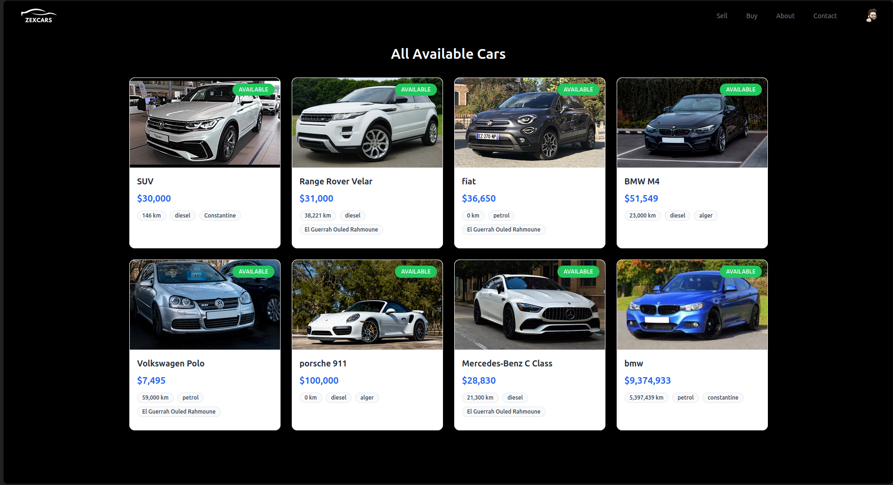

# ZEX-Cars

A modern website for car buying and selling, with user and admin interfaces.





_Modern platform for car buying and selling_

## 📖 Overview

ZEX-Cars is a comprehensive platform designed to facilitate car buying and selling. Users can create accounts to list their vehicles or browse available cars. The admin interface provides oversight of all transactions, managing buying and selling requests efficiently.

## ✨ Features

- User account creation and management
- Car listing for selling
- Car browsing and purchasing
- Admin dashboard for request management
- User profiles with transaction history
- Deal confirmation/rejection system
- Responsive design for all devices

## 🚀 Getting Started

### Prerequisites

- Node.js (v14.0.0 or higher)
- npm or yarn
- MongoDB

### Installation

1. Clone the repository

```bash
git clone https://github.com/yourusername/zex-cars.git
cd zex-cars
```

2. Install dependencies

```bash
npm install
# or
yarn install
```

3. Set up environment variables

```bash
PORT=<port>
MONGO_URI=<MongoDb URI>
SESSION_SECRET=<Session secret>
# Edit .env file with your configuration
```

4. Start the application

```bash
npm start
# or
yarn start
```

## 📸 Screenshots

Here are some screenshots of the ZEX-Cars application in action:

## 🔧 Technologies

- Frontend: React.js, Tailwind CSS, shadcn UI, Axios, ESLint, Vite
- Backend: Express.js, MongoDB, Mongoose
- Authentication: Passport.js
- Session Management: express-session

## 🤝 Contributing

Contributions, issues, and feature requests are welcome!

1. Fork the Project
2. Create your Feature Branch (`git checkout -b feature/AmazingFeature`)
3. Commit your Changes (`git commit -m 'Add some AmazingFeature'`)
4. Push to the Branch (`git push origin feature/AmazingFeature`)
5. Open a Pull Request

## 📄 License

This project is licensed under the MIT License - see the LICENSE file for details.

Project Link: [https://github.com/AtmaniChouaib22/zex-cars](https://github.com/AtmaniChouaib22/zex-cars)
